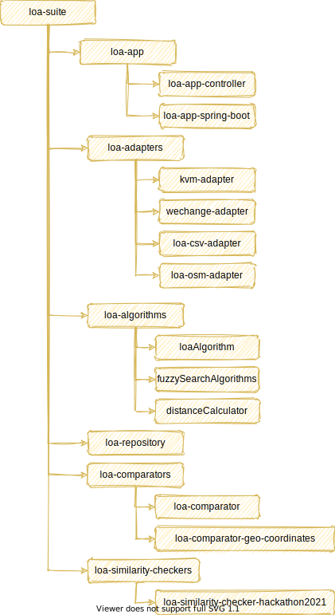

# loa-suite
This is the linked-open-actors () main project. A so called Maven-Multi-Module project containing all loa projects.

# Project structure

- loa-suite
    - loa-app
        - loa-app-controller
        - loa-app-spring-boot
    - loa-adapters
        - [loa-kvm-adapter](loa-adapters/loa-kvm-adapter/README)  
         [loa-suite](loa-adapters/loa-kvm-adapter/README.md)
        - loa-wechange-adapter
    - loa-algorithms
        - loa-algorithm
        - loa-fuzzySearchAlgorithms
        - loa-distanceCalculator
    - loa-repository
