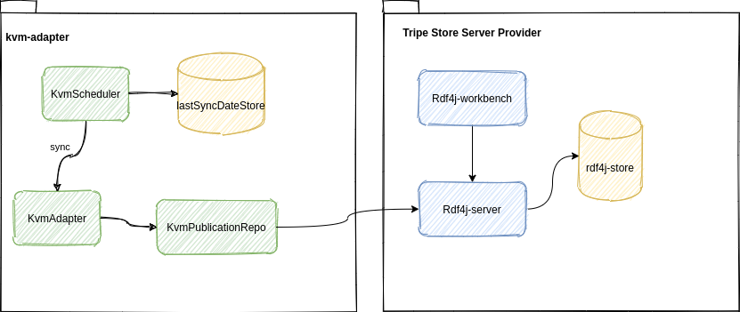

# The Karte von Morgen (KVM) adapter
The kvm-adapter is a module of the [loa-suite](../../README.md)   
There is a KvmScheduler, that triggers the synchronisation with [Karte vom Morgen](https://kartevonmorgen.org/) in regular intervals.  
The last sync date is stored in the database and each time the sync is triggered, all changes since the last sync are read from KVM.  
The KvmAdapter uses an abstraction of an rdf publicationRepository to save the publications.
  
