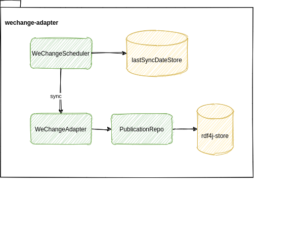

# The WECHANGE adapter
The wechange-adapter is a module of the [loa-suite](../../README.md)   
There is a WeChangeScheduler, that triggers the synchronisation with [WECHANGE](https://wechange.de/) in regular intervals.  
The last sync date is stored in the database and each time the sync is triggered, all changes since the last sync are read from WECHANGE.  
The WeChangeAdapter uses an abstraction of an rdf publicationRepository to save the publications.
  

